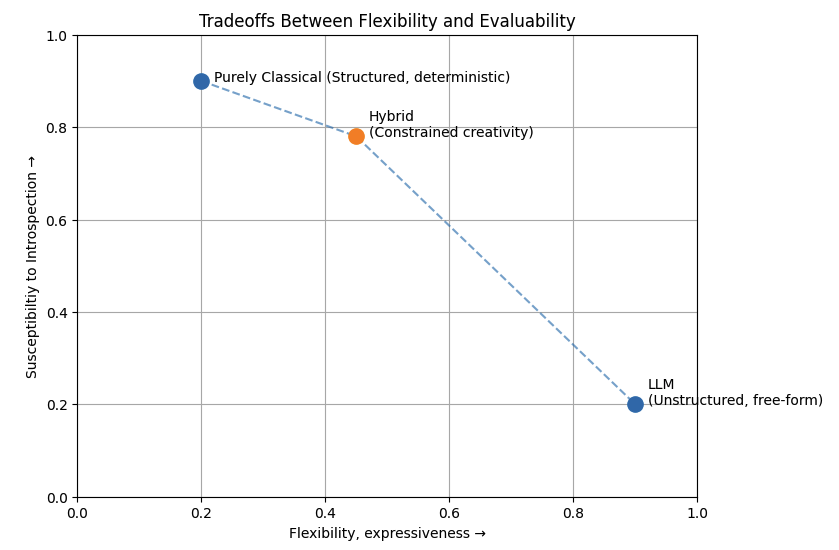
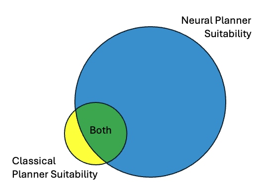

# Structured Evaluation of Classical vs Neural Planners

## Overview

This project compares classical/rule-based and neural-net-backed planners in a real-world application: lawn irrigation under uncertainty.

We introduce a **structured intermediate representation** that decouples perception from decision-making and planning from downstream actions. This enables controlled, reproducible evaluation while still grounding the problem in real signals (weather forecasts, camera observations, irrigination historicals).

## Prologue  

Trivial systems submit readily to performance analysis given the limited state-space they occupy. Low-dimensional inputs and outputs give rise to relatively simple planners. From an evaluation standpoint, this is optimal. Implementations may be scored against how these systems perform across all permutations of inputs, decisions and outputs, leaving no room for debate about the resulting performance. As dimensionality of inputs and outputs grow, the state-space balloons and quickly becomes intractable to analyze. For example a system relying on text generated by a large language model (LLM) may have a billion+ potential output combinations in just the first couple of tokens generated, stymying evaluation. 

Constraining the input and output space of higher complexity systems reduces their potential creativity but makes them more susceptible to a rigorous evaluation. This conceptual landscape is plotted below. 



## System Design 

The system in question is subject to some important constraints: 
- As highlighted above, **reducing the state-space we have to reason over and act upon improves our ability to assert performance criteria**. 
- In this scenario and in most real-world systems, **evaluation requires a priori knowledge of what constitutes acceptable behavior**, without which establishing a suitable test-set becomes unapproachable.
- We recognize and acknowledge these planners are more different than they are alike, and must settle on evaluation criteria that presumes both are applicable to the domain problem. This requires us to minimize bias in our evaluation that preferentially caters to or disproportionally penalizes either. 



The above constraints motivate us to implement a hybrid solution (see orange point plotted above) on this landscape. Specifically, **by defining constrained, intermediate representations at the perception and action layers we aim to balance the expressivity of an LLM-like neural planner and the evaluability of a classical planner, while enabling a comparison of both.** 

### Representations

Connectivity with the world enables the agent to gauge context and plan before imposing its will. We elect to abstract the implementations of the [supporting services](#backing-services) to keep the agent layers compact and interpretable. The interfaces we select for each are motivated by the available input sources and output sinks, but use of tight schemas between these layers and the planner unlocks common performance expectations that underpin our evaluation strategy. These schemas are outlined below. 

#### Perception 

Perception layer operates off security camera footage of the lawn, historical precipitation, near-term forecast data and historical watering events. We bypass neural perception for precipitation and forecasts, but employ a classic and neural vision module to help assess respective benefits and drawbacks. 

TODO: paste more schema defs to help user appreciate underlying mechanism

#### Planning 

We implement a classic and LLM-based planner for comparison


All inputs are represented as **timestamped events**:

```python
@dataclass
class Event:
    timestamp: datetime          # when the event occurred
    source: str                  # e.g., "weather", "camera", "precip", "tick"
    type: str                    # e.g., "forecast", "scene", "measurement", "tick"
    payload: dict                # normalized data
```

#### Action 

Actions are limited to actuating watering of the lawn and notifying humans off errors/or conflicts (service call)

TODO: paste more schema defs to help user appreciate underlying mechanism

### Evaluation Support

The system depends on real-world cues and developments that occur over long-ish timespans. For example recent rainfall might perpetually postpone any planning logic about whether to water, since rainfall will short-circuit decisionmaking (no need to water if nature did it for us). Thus the 'normal' operating mode is insufficient for validation of the planner and its logic and motivates an 'offline' solution for vetting our implementations. We adopt two strategies here to cope: 
1) we tightly control the interface specifications between planner and its perceptions and actions, yielding a common language that can be simulated, inspected and hacked to assemble interesting counter-factuals (see [representations](#representations))
2) we employ a unified scheme for real-time execution and historical event playback that ensures our evaluations pass through the same planner code paths during both modes

### Bimodal Operation

We model the system as a **time-indexed, event-driven pipeline** with a strict separation between:

- **Event generation** (independent, asynchronous sources)
- **State aggregation** (deterministic, ordered reconstruction)
- **Decision points** (externally clocked via ticks)

This design supports both:
- **offline evaluation** (perfect ordering, reproducibility)
- **online operation** (bounded-latency, real-time behavior)

- All inputs are modeled as **timestamped event streams**
- Events are **independent**, but reconciled at ingestion time
- A **state aggregator** converts events into a discrete planner input
- **Ticks act as decision boundaries**, enforcing consistent evaluation timing
- Offline mode uses **perfect ordering** for reproducibility
- Online mode uses **bounded ordering** for realism
- The planner is **time-agnostic**, operating only on state

TODO: figure out how to unify the eval and real-time modes, can we just use the generator paradigm?

Each backing service exposes an independent generator:
```
def weather_stream(...) -> Iterator[Event]
def precipitation_stream(...) -> Iterator[Event]
def camera_stream(...) -> Iterator[Event]
def irrigation_stream(...) -> Iterator[Event]
def tick_stream(start, end, interval) -> Iterator[Event]
```

#### Offline (Evaluation mode) 

TODO: design and implement using below snippets as cue: 

```
events = sorted(all_events, key=lambda e: e.timestamp)

for event in events:
    state = aggregator.update(event)

    if event.type == "tick":
        decision = planner(state)
        log(event.timestamp, state, decision)
```

Properties:

- perfect ordering
- deterministic
- used for evaluation and dataset generation

Dataset generation: 

```
for t in sampled_timestamps:
    state = build_state_from_events_up_to(t)
    label = human_label(t)
    dataset.append((t, state, label))
``` 

#### Online (Live mode) 

TODO: design and implement using below snippet as a cue: 

```
buffer = []
max_seen = None

def ingest(event):
    global max_seen
    max_seen = max(max_seen, event.timestamp) if max_seen else event.timestamp
    heapq.heappush(buffer, (event.timestamp, event))

def flush_up_to(ts):
    while buffer and buffer[0][0] <= ts:
        _, event = heapq.heappop(buffer)
        aggregator.update(event)

def main_loop():
    for event in incoming_events():
        ingest(event)

        if event.type == "tick":
            flush_up_to(event.timestamp)
            decision = planner(state)
            emit(decision)
```

## System Operation 

TODO: insert description of how to interact with the sysetm in eval/playback or real-time modes

## Evaluation 

TODO: insert desciprtion of how to evaluate playback mode outputs to emit a performance assessment

## Backing Services

### 🌤️ Weather 

National Weather Service forecast integration is implemented in-repo under [services/weather](/Users/jason/Local/school/590-agents/project2/agent-bakeoff/services/weather/README.md).

Planner code should prefer importing the module directly instead of shelling out to an external command.

The current helper surface is intentionally small:

- `WeatherClient.from_env()`: construct the client from environment overrides
- `fetch_point(lat, lon)`: resolve a point to NWS office, grid, timezone, and forecast URLs
- `fetch_forecast(lat, lon)`: fetch the standard forecast periods for that point
- `fetch_hourly_forecast(lat, lon)`: fetch the hourly forecast periods for that point

Direct Python usage:

```python
import asyncio

from services.weather import WeatherClient


async def main() -> None:
    async with WeatherClient.from_env() as client:
        forecast = await client.fetch_forecast(42.8864, -78.8784)
        hourly = await client.fetch_hourly_forecast(42.8864, -78.8784)
        print(forecast.periods[0].short_forecast)
        print(hourly.periods[0].temperature)


asyncio.run(main())
```

Critical implementation details:

- The supported input is latitude and longitude. City and state are not currently supported because the NWS API's native forecast path starts from a point lookup and city/state would require a separate geocoding provider.
- The client must call `https://api.weather.gov/points/{lat},{lon}` first, then follow the returned `forecast` and `forecastHourly` URLs instead of hard-coding gridpoint URLs.
- NWS requires a meaningful `User-Agent` header on requests. Set `NWS_USER_AGENT` in your shell if you want something more descriptive than the module default.
- The client sends `Accept: application/geo+json` and normalizes the response into dataclasses for planner-facing use.
- Grid coordinates and issuing office can change over time, so callers should not treat previously resolved grid metadata as immutable.

Configuration:

- `NWS_USER_AGENT`: override the request user agent sent to `api.weather.gov`
- `NWS_API_BASE_URL`: optional base URL override for testing

Verification notes:

- Live endpoint validation against `api.weather.gov` succeeded for Buffalo, NY on April 17, 2026 using `42.8864, -78.8784`.
- That probe successfully resolved the point metadata and retrieved both daily and hourly forecasts through the production NWS API.

### 💦 Irrigation Control

Orbit B-hyve irrigation control is implemented in-repo under [services/bhyve](/Users/jason/Local/school/590-agents/project2/agent-bakeoff/services/bhyve/README.md). This service provides the actuation path used by the agent for lawn watering.

The current helper surface is intentionally small:

- `devices`: list known B-hyve devices
- `status`: inspect the selected irrigation device
- `programs`: inspect configured watering programs
- `history`: inspect watering history
- `landscapes`: inspect smart-watering landscape parameters
- `on --seconds N`: turn the valve on now
- `off`: turn the valve off now
- `cycle --seconds N`: turn the valve on, hold for `N` seconds, then turn it off

Run from the repository root:

```bash
python -m services.bhyve.controller devices
python -m services.bhyve.controller status
python -m services.bhyve.controller on --seconds 60
python -m services.bhyve.controller off
python -m services.bhyve.controller cycle --seconds 5
```

Verification notes:

- Physical valve actuation on the HT25 has been confirmed manually.
- Websocket acknowledgements from Orbit are unreliable for this device path.
- REST polling is available as secondary evidence with `--poll`, but should not be treated as the primary proof that the valve moved.

Provenance:

- `services/bhyve/controller.py` and the CLI shape are project code for this repo.
- `services/bhyve/vendor/pybhyve/` is a vendored minimal dependency derived from the upstream `sebr/pybhyve` client so the submission remains self-contained.

### ☔️ Precipitation Historicals 

USGS weather status, current via API 

Note:

- The request URL, headers, and payload below were captured from the USGS web client in a browser and are included as reverse-engineering notes.
- The automated query used by `services.precipitation` is simpler than this captured browser request and does not require the full browser header set.
- The `x-api-key` shown below came from the scraped web-client request and should not be treated as a project credential or a required input for programmatic access.

Programmatic usage:

- Import from `services.precipitation`.
- Main entry point: `PrecipitationClient`.
- Window inputs accepted by the helper: ISO-8601 durations like `P30D`, shorthand like `30D`, `12H`, `90M`, `2W`, or a Python `datetime.timedelta`.
- Primary methods:
  - `fetch_raw(window)`: return the upstream JSON payload.
  - `fetch_samples(window)`: return normalized `PrecipitationSample` objects.
  - `total_precipitation(window)`: return the summed rainfall depth in inches.
  - `summarize(window)`: return a `PrecipitationSummary` with total inches, sample count, start/end timestamps, and the normalized samples.
- The helper works without an API key for ordinary requests. If a valid key is available, it can be provided via `USGS_WATERDATA_API_KEY` or `PrecipitationClient(api_key=...)` for higher rate limits.
- Override the default precipitation time series with `USGS_PRECIP_TIME_SERIES_ID` or `PrecipitationClient(time_series_id=...)`.

Example:

```python
import asyncio
import datetime as dt

from services.precipitation import PrecipitationClient


async def main() -> None:
    async with PrecipitationClient() as client:
        summary = await client.summarize(dt.timedelta(days=7))
        print(
            {
                "window": summary.window,
                "total_inches": summary.total_inches,
                "sample_count": summary.sample_count,
                "started_at": summary.started_at.isoformat() if summary.started_at else None,
                "ended_at": summary.ended_at.isoformat() if summary.ended_at else None,
            }
        )


asyncio.run(main())
```

Sample request URL: 
https://api.waterdata.usgs.gov/ogcapi/v0/collections/continuous/items?limit=50000&properties=time,value,unit_of_measure,approval_status,qualifier&time_series_id=30259de5ae144951809547f26f5df5d5&time=P30D

Sample browser headers: 
```
:authority
api.waterdata.usgs.gov
:method
GET
:path
/ogcapi/v0/collections/continuous/items?limit=50000&properties=time,value,unit_of_measure,approval_status,qualifier&time_series_id=30259de5ae144951809547f26f5df5d5&time=P30D
:scheme
https
accept
*/*
accept-encoding
gzip, deflate, br, zstd
accept-language
en-US,en;q=0.9
origin
https://waterdata.usgs.gov
priority
u=1, i
referer
https://waterdata.usgs.gov/
sec-ch-ua
"Chromium";v="146", "Not-A.Brand";v="24", "Google Chrome";v="146"
sec-ch-ua-mobile
?0
sec-ch-ua-platform
"macOS"
sec-fetch-dest
empty
sec-fetch-mode
cors
sec-fetch-site
same-site
user-agent
Mozilla/5.0 (Macintosh; Intel Mac OS X 10_15_7) AppleWebKit/537.36 (KHTML, like Gecko) Chrome/146.0.0.0 Safari/537.36
x-api-key
9buRZ7LEGzVV75cf7lB68E8fgNphGqkLhhAVnNV
```

Sample response paylaod:

```
{
    "type":"FeatureCollection",
    "features":[
        {
            "type":"Feature",
            "properties":{
                "time":"2026-03-18T17:50:00+00:00",
                "value":"0.00",
                "unit_of_measure":"in",
                "approval_status":"Provisional",
                "qualifier":null
            },
            "id":"fe7e54c5-889a-4312-8d8b-0de4707d1544",
            "geometry":null
        },
        {
            "type":"Feature",
            "properties":{
                "time":"2026-03-18T17:55:00+00:00",
                "value":"0.00",
                "unit_of_measure":"in",
                "approval_status":"Provisional",
                "qualifier":null
            },
            "id":"d436b9f1-7926-470b-b73e-0733e1fd2ae1",
            "geometry":null
        },
        // many elements pruned for readability...
        {
            "type":"Feature",
            "properties":{
                "time":"2026-04-17T17:25:00+00:00",
                "value":"0.00",
                "unit_of_measure":"in",
                "approval_status":"Provisional",
                "qualifier":null
            },
            "id":"5f0912cd-7f4c-426e-b262-5abe6dd64555",
            "geometry":null
        },
        {
            "type":"Feature",
            "properties":{
                "time":"2026-04-17T17:30:00+00:00",
                "value":"0.00",
                "unit_of_measure":"in",
                "approval_status":"Provisional",
                "qualifier":null
            },
            "id":"41a0a647-8b8c-400a-a696-903253201d0c",
            "geometry":null
        },
        {
            "type":"Feature",
            "properties":{
                "time":"2026-04-17T17:35:00+00:00",
                "value":"0.00",
                "unit_of_measure":"in",
                "approval_status":"Provisional",
                "qualifier":null
            },
            "id":"46de3eb2-306e-46dc-bcbf-a0d4241f1fdd",
            "geometry":null
        }
    ],
    "numberReturned":8638,
    "links":[
        {
            "type":"application/geo+json",
            "rel":"self",
            "title":"This document as GeoJSON",
            "href":"https://api.waterdata.usgs.gov/ogcapi/v0/collections/continuous/items?f=json&limit=50000&properties=time,value,unit_of_measure,approval_status,qualifier&time_series_id=30259de5ae144951809547f26f5df5d5&time=P30D"
        },
        {
            "rel":"alternate",
            "type":"application/ld+json",
            "title":"This document as RDF (JSON-LD)",
            "href":"https://api.waterdata.usgs.gov/ogcapi/v0/collections/continuous/items?f=jsonld&limit=50000&properties=time,value,unit_of_measure,approval_status,qualifier&time_series_id=30259de5ae144951809547f26f5df5d5&time=P30D"
        },
        {
            "type":"text/html",
            "rel":"alternate",
            "title":"This document as HTML",
            "href":"https://api.waterdata.usgs.gov/ogcapi/v0/collections/continuous/items?f=html&limit=50000&properties=time,value,unit_of_measure,approval_status,qualifier&time_series_id=30259de5ae144951809547f26f5df5d5&time=P30D"
        },
        {
            "type":"text/csv; charset=utf-8",
            "rel":"alternate",
            "title":"This document as CSV",
            "href":"https://api.waterdata.usgs.gov/ogcapi/v0/collections/continuous/items?f=csv&limit=50000&properties=time,value,unit_of_measure,approval_status,qualifier&time_series_id=30259de5ae144951809547f26f5df5d5&time=P30D"
        },
        {
            "type":"application/json",
            "title":"Continuous values",
            "rel":"collection",
            "href":"https://api.waterdata.usgs.gov/ogcapi/v0/collections/continuous"
        }
    ],
    "timeStamp":"2026-04-17T17:47:41.695609Z"
}
```

### 📸 Security Camera Video Feed

#### RTSP ingest

The RTSP helper now lives in [services/rtsp](/Users/jason/Local/school/590-agents/project2/agent-bakeoff/services/rtsp/README.md). Its main entry point is [services/rtsp/ingest.py](/Users/jason/Local/school/590-agents/project2/agent-bakeoff/services/rtsp/ingest.py). It uses `ffmpeg` to decode a live stream into raw `bgr24` frames and hands those frames to an OpenCV loop. The script is intended to be the bridge from shell-level stream validation to agent perception logic.

By default the script uses `ffprobe` to infer the stream width and height before starting the rawvideo pipe. You only need `--width` or `--height` if the stream metadata is wrong or unavailable.

Do not commit real stream URLs, credentials, or camera-specific paths. Pass the feed URL at runtime via `--url` or an environment variable in your local shell session.

Run from the repository root.

Default validation flow:

```bash
python -m services.rtsp.ingest --url 'rtsps://camera.example.local:7441/your-stream-path'
```

That command:

- probes stream dimensions with `ffprobe`
- starts `ffmpeg` raw-frame ingest
- logs frame timing
- saves 10 sampled JPEGs into `debug_frames/session_01`
- exits automatically after the debug capture completes

Live display while continuing to ingest:

```bash
python -m services.rtsp.ingest \
  --url 'rtsps://camera.example.local:7441/your-stream-path' \
  --display \
  --debug-max-saved 0
```

Continuous ingest without display or debug writes:

```bash
python -m services.rtsp.ingest \
  --url 'rtsps://camera.example.local:7441/your-stream-path' \
  --print-every 0 \
  --debug-max-saved 0
```

Useful options:

- `--max-frames 300` for short smoke tests
- `--print-every 0` to suppress per-frame logging
- `--tls-verify` if your RTSPS endpoint has a certificate you want to validate
- `--ffmpeg-bin /opt/homebrew/bin/ffmpeg` if `ffmpeg` is not already on `PATH`
- `--ffprobe-bin /opt/homebrew/bin/ffprobe` if `ffprobe` is not already on `PATH`
- `--debug-max-saved 0` to disable debug frame writes and keep the stream running continuously

#### Debug frame capture

The default debug behavior is now a short validation run that saves 10 JPEGs to `debug_frames/session_01`, taking one every 30 source frames:

```bash
python -m services.rtsp.ingest --url 'rtsps://camera.example.local:7441/your-stream-path'
```

You can still override any part of that:

```bash
python -m services.rtsp.ingest \
  --url 'rtsps://camera.example.local:7441/your-stream-path' \
  --debug-output-dir debug_frames/session_02 \
  --debug-sample-every 15 \
  --debug-max-saved 20
```

The filenames include both the saved-frame index and the source-frame number, so you can tell how the sampling landed in the live stream.

Current shape:

- `ffmpeg` handles the RTSP/RTSPS session and decode
- Python receives fixed-size `numpy` frames in `BGR`
- the main loop is the place to attach perception or agent-facing logic

## Requirements

- Python 3
- `numpy`
- `opencv-python`
- `aiohttp`
- `ffmpeg`
